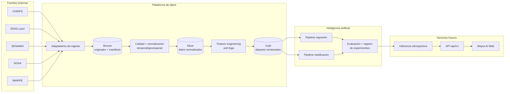
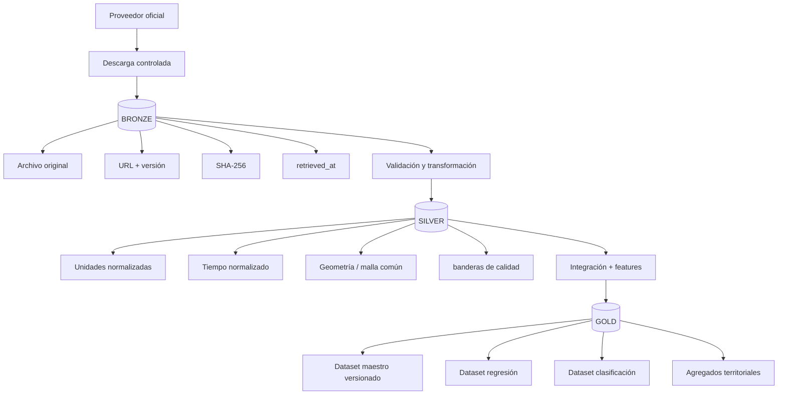
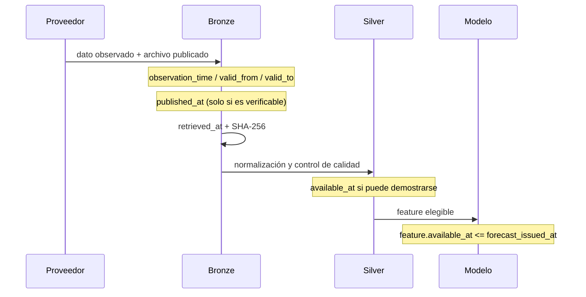
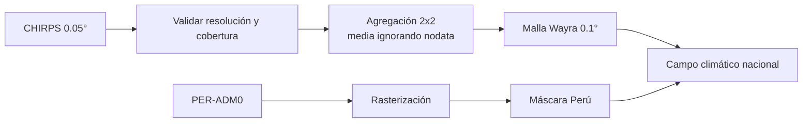
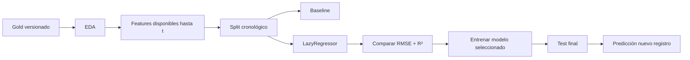
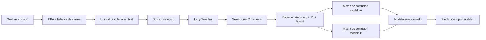
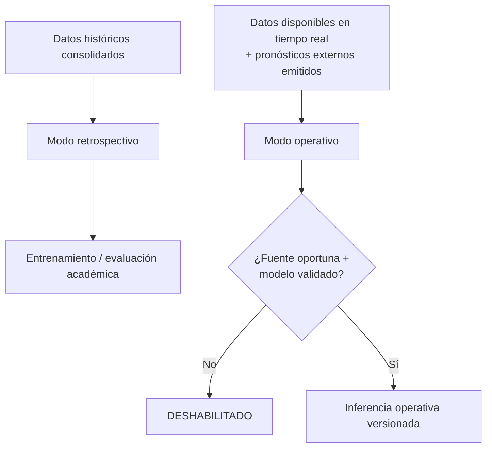
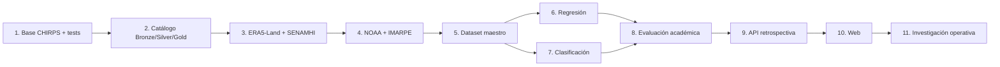

# Wayra AI

> Plataforma de investigación para análisis climático y predicción de precipitaciones en el Perú.


Wayra AI integra datos climáticos, oceanográficos y territoriales con una arquitectura reproducible orientada a dos problemas de aprendizaje supervisado: **regresión de precipitación futura** y **clasificación de lluvia extrema**. El alcance geográfico objetivo es **Perú completo**, usando una cuadrícula común de 0.1° para los productos rasterizados.

> [!IMPORTANT]
> Wayra AI es un proyecto académico y de investigación. **No emite alertas oficiales, no reemplaza a SENAMHI, ENFEN, INDECI, ANA ni CENEPRED y no debe usarse por sí solo para decisiones de emergencia.** El modo operativo permanece deshabilitado hasta contar con fuentes oportunas, modelos validados y evaluación temporal adecuada.

## Estado real del repositorio

La documentación distingue deliberadamente entre lo que existe en código y lo que forma parte de la arquitectura objetivo.

| Componente | Estado | Evidencia en el repositorio |
|---|---|---|
| Ingesta CHIRPS v3 diaria | 🟩 Implementado | `src/wayra/ingestion/chirps.py` |
| Trazabilidad de descarga y SHA-256 | 🟩 Implementado | manifiesto de ingesta + pruebas unitarias |
| Malla nacional 0.1° | 🟩 Implementado | `src/wayra/preprocessing/mesh.py` |
| Máscara territorial de Perú | 🟩 Implementado | `src/wayra/preprocessing/mask.py` + GeoJSON PER-ADM0 |
| Remuestreo CHIRPS 0.05° → 0.1° | 🟩 Implementado | agregación de bloques validada por tests |
| Pruebas automáticas | 🟨 En desarrollo | `tests/` + GitHub Actions |
| ERA5-Land | 🟦 Planificado | adaptador y contrato pendientes |
| SENAMHI | 🟦 Planificado | adaptador y auditoría de dataset pendientes |
| NOAA / IMARPE | 🟦 Planificado | subsistema oceanográfico pendiente |
| Dataset maestro multi-fuente | 🟦 Planificado | Data Lake Silver/Gold pendiente |
| Regresión + LazyRegressor | 🟦 Planificado | sin métricas finales todavía |
| Clasificación + LazyClassifier | 🟦 Planificado | sin métricas finales todavía |
| API FastAPI | 🟦 Planificado | `apps/api/` aún no contiene implementación funcional |
| Aplicación web | 🟦 Planificado | `apps/web/` aún no contiene implementación funcional |
| Pronóstico operativo | ⛔ Deshabilitado | decisión arquitectónica explícita |

**No existen todavía métricas finales verificadas de RMSE, R², Balanced Accuracy, F1 o matrices de confusión.** Los smoke tests históricos del repositorio no sustituyen una evaluación con conjuntos train/validation/test suficientes.

---

## Objetivos

1. Integrar datos climáticos auténticos y trazables para todo el Perú.
2. Construir un dataset maestro espacio-temporal con control de procedencia y disponibilidad.
3. Comparar modelos de regresión para estimar precipitación futura en milímetros.
4. Comparar modelos de clasificación para detectar superación de umbrales de lluvia extrema.
5. Separar rigurosamente el análisis retrospectivo de cualquier futura capacidad operativa.
6. Mantener una arquitectura extensible para peligros naturales sin atribuir capacidades predictivas no validadas.

## Fuentes de datos

| Subsistema | Fuente | Uso previsto | Estado de integración |
|---|---|---|---|
| Precipitación | [CHIRPS v3](https://data.chc.ucsb.edu/products/CHIRPS/v3.0/) | lluvia histórica diaria y variable objetivo candidata | 🟩 primer adaptador implementado |
| Atmósfera terrestre | [ERA5-Land](https://cds.climate.copernicus.eu/datasets/reanalysis-era5-land) | temperatura, punto de rocío, presión, viento y otras variables | 🟦 pendiente |
| Observaciones Perú | [SENAMHI - Datos abiertos](https://www.datosabiertos.gob.pe/dataset/variables-meteorologicas-de-las-estaciones-autom%C3%A1ticas-de-intercambio-internacional-servicio) | contraste y observaciones de estaciones | 🟦 pendiente |
| Océano / ENOS | [NOAA CPC](https://www.cpc.ncep.noaa.gov/data/indices/) | Niño 1+2, Niño 3.4 y otros indicadores oceánicos | 🟦 pendiente |
| Océano costero | [IMARPE - Datos abiertos](https://www.datosabiertos.gob.pe/) | TSM y anomalías costeras | 🟦 pendiente |
| Territorio | [geoBoundaries](https://www.geoboundaries.org/) | límite nacional para máscara espacial | 🟩 incorporado |
| Emergencias | INDECI / SINPAD | extensión futura de análisis de peligros | 🟦 fuera del MVP predictivo actual |

Cada fuente mantiene su propia licencia y condiciones de uso. La licencia del código de Wayra AI está **pendiente de decisión** y no debe confundirse con las licencias de los datasets.

---

## Arquitectura objetivo



### Qué está implementado hoy

El repositorio actual cubre principalmente el tramo **CHIRPS → ingesta → malla/máscara → preprocesado**. Los componentes Gold, ML, API y web del diagrama son la arquitectura objetivo y se implementarán de forma incremental.

---

## Arquitectura de datos: Bronze / Silver / Gold



Principios:

- **Bronze es inmutable**: conserva el original descargado.
- **Silver es auditable**: normaliza sin perder procedencia.
- **Gold es reproducible**: cada dataset de entrenamiento tiene versión y contrato.
- Los datos raster voluminosos no tienen por qué almacenarse íntegramente en PostgreSQL; el catálogo y la metadata sí pueden persistirse allí y ampliarse con PostGIS.

---

## Trazabilidad temporal

Una fecha de observación no es necesariamente la fecha en la que un dato estuvo disponible para una predicción.



Wayra AI conserva o proyecta los siguientes campos:

- `observation_time` o `valid_from` / `valid_to`
- `published_at` cuando exista evidencia
- `source_last_modified` como metadato HTTP, sin confundirlo con publicación científica
- `retrieved_at`
- `available_at` cuando pueda reconstruirse de manera verificable
- `forecast_issued_at` para inferencia
- `source_version`, `dataset_version` y checksums

La ingesta CHIRPS actual **no inventa `published_at`**: la fecha del nombre del archivo se registra como observación, no como fecha de publicación.

---

## Procesamiento geoespacial

La decisión vigente es trabajar con una cuadrícula regular de **0.1° en EPSG:4326** para todo Perú.



`regrid_block()` valida que la resolución destino sea un múltiplo entero de la fuente. Para CHIRPS 0.05° → Wayra 0.1°, el factor esperado es 2. La función también valida cobertura, nodata y forma de salida.

> La cuadrícula 0.1° es una representación analítica. No implica una precisión física uniforme de 10 km ni reemplaza la resolución de la fuente original.

---

## Pipelines de inteligencia artificial

### Regresión

Objetivo académico propuesto: `precipitation_next_day_mm`.



Métricas obligatorias: **RMSE y R²**. Se añadirá MAE como apoyo. No se publicarán valores hasta ejecutar el experimento con un test real y suficiente.

### Clasificación

Objetivo académico propuesto: detectar si la precipitación del día siguiente supera un umbral extremo definido con el conjunto de entrenamiento o una climatología de referencia previamente fijada.



La clase positiva significa **lluvia extrema según el umbral definido**, no “inundación”, “huaico” ni “desastre”.

---

## Análisis retrospectivo vs. pronóstico operativo



El MVP se concentra primero en el **modo retrospectivo**. Productos de reanálisis o datos definitivos publicados con retraso no pueden tratarse automáticamente como entradas disponibles en tiempo real.

---

## Peligros naturales

El dominio de peligros se mantendrá desacoplado de los modelos meteorológicos.

Una predicción de precipitación extrema **no equivale** a una probabilidad de inundación, huaico, deslizamiento o desborde. Cada peligro futuro deberá tener:

- definición del evento;
- dataset histórico verificable;
- variables apropiadas (hidrología, topografía, geología, etc.);
- modelo especializado;
- validación independiente;
- métricas y limitaciones documentadas.

---

## Archify: arquitectura interactiva

Wayra AI utiliza **Mermaid** para diagramas directamente legibles en Markdown y mantiene fuentes de **Archify** para explorar la arquitectura de forma interactiva.

Archivos existentes:

```text
docs/architecture/diagrams/
├── architecture_wayra.json
├── dataflow_wayra.json
├── lifecycle_wayra.json
└── wayra-propuesta.architecture.json
```

El flujo recomendado es:

```bash
# 1. Instalar la skill de Archify
npx skills add tt-a1i/archify -g

# 2. Desde OpenCode, solicitar que use Archify sobre el JSON de arquitectura
#    y genere un HTML self-contained.

# 3. Validar el artefacto con el perfil showcase antes de publicarlo.
#    La ruta exacta de bin/archify.mjs depende de dónde haya instalado la skill.
```

Ejemplo conceptual si se ejecuta desde el repositorio de Archify o desde una instalación que exponga su CLI:

```bash
node bin/archify.mjs validate architecture \
  docs/architecture/diagrams/wayra-propuesta.architecture.json \
  --quality showcase --json

node bin/archify.mjs deliver architecture \
  docs/architecture/diagrams/wayra-propuesta.architecture.json \
  docs/architecture/diagrams/wayra-propuesta.architecture.html \
  --quality showcase --json

node bin/archify.mjs visual-check \
  docs/architecture/diagrams/wayra-propuesta.architecture.html \
  --json
```

GitHub no ejecuta un HTML interactivo dentro del README; el archivo generado debe abrirse localmente o publicarse posteriormente mediante un mecanismo de hosting. Los JSON son la fuente versionable y deben actualizarse cuando cambie la arquitectura.

Más detalle: [`docs/architecture/archify.md`](docs/architecture/archify.md).

---

## Estructura del repositorio

```text
Wayra_AI/
├── .agents/                  # skills/contexto para agentes
├── .github/workflows/        # CI
├── .opencode/                # configuración y plugin Graphify
├── apps/
│   ├── api/                  # futuro backend FastAPI
│   └── web/                  # futura aplicación web
├── data/
│   ├── external/             # recursos externos pequeños y versionables
│   ├── raw/                  # Bronze local (ignorado cuando corresponde)
│   └── processed/            # Silver/Gold local
├── docs/
│   ├── architecture/
│   ├── knowledge/            # memoria Obsidian
│   ├── sources/
│   └── academic/
├── models/                   # artefactos ML (cuando existan)
├── scripts/                  # smokes y utilidades reproducibles
├── src/wayra/
│   ├── ingestion/
│   └── preprocessing/
├── tests/
├── AGENTS.md
├── pyproject.toml
└── README.md
```

Las carpetas vacías reservan dominios futuros; **su existencia no significa que la funcionalidad ya esté implementada**.

---

## Instalación para desarrollo

### Requisitos

- Python 3.12
- Git
- recomendado: [uv](https://docs.astral.sh/uv/)

### Con uv

```bash
git clone https://github.com/Lobitoxxx/Wayra_AI.git
cd Wayra_AI
uv sync --group dev
```

Ejecutar pruebas:

```bash
uv run pytest
```

Ejemplo de ingesta CHIRPS:

```bash
uv run python -m wayra.ingestion.chirps 2024-06-15
```

El comando descarga información desde una fuente externa; su éxito depende de conectividad y disponibilidad del proveedor.

### Con pip

```bash
python -m venv .venv
# Windows
.venv\Scripts\activate
# Linux/macOS
source .venv/bin/activate

python -m pip install -e . pytest pytest-cov
pytest
```

---

## Calidad y CI

GitHub Actions ejecuta sobre Python 3.12:

1. instalación del paquete;
2. compilación de fuentes;
3. pruebas unitarias;
4. reporte de cobertura.

Las pruebas actuales se concentran en:

- parsing y trazabilidad temporal de CHIRPS;
- comportamiento de checksum;
- agregación 0.05° → 0.1°;
- nodata;
- incompatibilidad de resoluciones;
- contratos de forma de la malla.

Las pruebas científicas de modelos se añadirán cuando existan datasets Gold reproducibles.

---

## Trazabilidad de requisitos académicos

| Rúbrica | Artefacto objetivo | Estado |
|---|---|---|
| EDA de regresión | `docs/academic/` + notebook/script reproducible | pendiente |
| Preparación X/y y split | pipeline Gold + temporal split | pendiente |
| LazyRegressor | benchmark versionado | pendiente |
| RMSE / R² y ganador | reporte de experimento | pendiente |
| Nueva predicción de regresión | inferencia retrospectiva | pendiente |
| EDA de clasificación | reporte con balance de clases | pendiente |
| LazyClassifier | benchmark versionado | pendiente |
| Top 2 + matrices de confusión | reporte de evaluación | pendiente |
| Nueva predicción y probabilidad | inferencia retrospectiva | pendiente |

Consulta la especificación académica en [`docs/academic/avance-2-mapping.md`](docs/academic/avance-2-mapping.md).

---

## Documentación

- [Especificación técnica](docs/architecture/wayra-ai-specification.md)
- [Catálogo de datasets](docs/sources/dataset-catalog.md)
- [Integración Archify](docs/architecture/archify.md)
- [Arquitectura base](docs/architecture/00-arquitectura.md)
- [Requisitos](docs/knowledge/02-requirements.md)
- [Decisiones ADR](docs/knowledge/08-decisions.md)
- [Estado/progreso](docs/knowledge/07-progress.md)
- [Mapeo de la rúbrica](docs/academic/avance-2-mapping.md)

`AGENTS.md` contiene reglas de trabajo para OpenCode y otros agentes: usar memoria selectiva, Graphify/Archify cuando aporten valor, comprobar el código y no inventar métricas.

---

## Hoja de ruta



Prioridad inmediata: **construir una serie temporal nacional suficiente y un dataset Gold reproducible antes de entrenar modelos o diseñar dashboards como si ya existieran resultados finales.**

## Limitaciones actuales

- La serie CHIRPS usada en smokes anteriores era demasiado corta para una evaluación científica final.
- Los adaptadores ERA5-Land, SENAMHI, NOAA e IMARPE todavía no forman parte del código funcional.
- No existen modelos persistidos ni resultados finales versionados.
- API y frontend siguen siendo arquitectura objetivo.
- La fecha de publicación histórica de cada fuente no siempre puede reconstruirse; cuando no haya evidencia se registra como desconocida.
- La cuadrícula 0.1° no elimina incertidumbre espacial ni convierte una estimación raster en una observación de estación.

## Seguridad y credenciales

- Nunca versionar claves CDS, tokens o contraseñas.
- Utilizar `.env` o mecanismos locales equivalentes, excluidos por Git.
- No imprimir secretos en logs, notebooks o documentación.
- Validar licencias y condiciones de redistribución antes de incluir datasets en releases.

## Licencia

La licencia del **código** todavía no ha sido seleccionada. No asumir MIT, Apache-2.0 u otra licencia hasta que exista un archivo `LICENSE` aprobado.

Los **datos** conservan las licencias y términos de sus proveedores respectivos.

---

### Principio rector

> **Una predicción reproducible necesita datos trazables, un instante de disponibilidad verificable y una evaluación honesta.** Wayra AI prioriza esas propiedades antes de convertir resultados experimentales en funcionalidades visibles.
