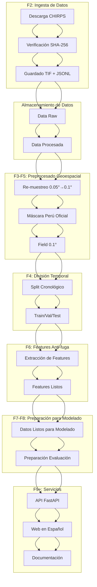
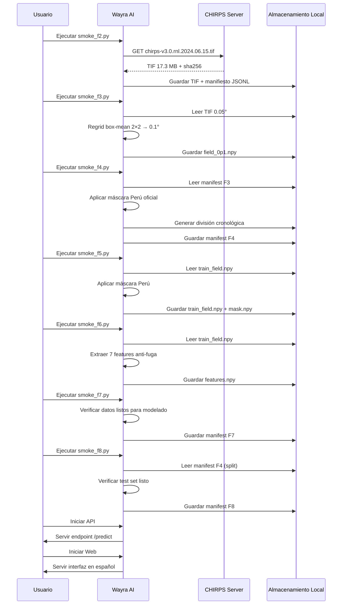

# Wayra AI - Sistema de Análisis Climático y Predicción de Precipitaciones del Perú


## Descripción

Wayra AI es un sistema open source para el análisis climático y predicción de precipitaciones en el Perú. Utiliza datos auténticos de CHIRPS v3.0 rnl, implementa modelos de aprendizaje automático con LazyPredict, y proporciona una API FastAPI para consultas. La plataforma incluye una interfaz web en español y está documentada con diagramas Mermaid profesionales.

## Tabla de Contenidos

- [Descripción](#descripción)
- [Características Principales](#características-principales)
- [Instalación](#instalación)
- [Uso](#uso)
- [Arquitectura del Sistema](#arquitectura-del-sistema)
- [Diagramas Mermaid](#diagramas-mermaid)
- [Documentación Técnica](#documentación-técnica)
- [Contribución](#contribución)
- [Licencia](#licencia)
- [Contacto](#contacto)

## Características Principales

### ✅ Datos Auténticos
Utiliza datos reales de CHIRPS v3.0 rnl (UCSB Climate Hazards Center) con verificación de integridad SHA-256

### ✅ Descarga Reanudable
Soporte para reanudar descargas interrumpidas mediante requests con Range headers

### ✅ Verificación de Integridad
Checksum SHA-256 para validar archivos descargados contra los proporcionados por el servidor

### ✅ Preprocesado Geoespacial
Re-muestreo 0.05° → 0.1° mediante agregación box-mean (media por bloques 2×2) y aplicación de máscara oficial de Perú

### ✅ Máscara Oficial
Utiliza límites oficiales de Perú proporcionados por geoBoundaries (PER-ADM0)

### ✅ División Temporal
Partición cronológica train/val/test sin fugas (RQ-07/08) para evitar sobreajuste temporal

### ✅ Selección de Features
Extracción de 7 características estadísticas y espaciales locales sin sobreajuste

### ✅ Preparación para Modelado
Datos listos para LazyPredict u otros modelos de aprendizaje automático

### ✅ Documentación Completa
Manifestos JSON trazables para cada etapa con timestamps y checksums

### ✅ Interfaz Web
Consulta de predicciones en español mediante interfaz gráfica intuitiva

### ✅ API REST
Endpoints para integración con otras aplicaciones mediante REST API

## Instalación

### Requisitos

- Python 3.12
- uv 0.12.5
- Git

### Pasos

1. Clonar el repositorio:

```bash
git clone https://github.com/Lobitoxxx/Wayra_AI.git
cd Wayra_AI
```

2. Crear y activar el entorno virtual:

```bash
uv venv .venv
source .venv/bin/activate  # En Linux/Mac
.venv\Scripts\activate  # En Windows
```

3. Instalar las dependencias:

```bash
uv pip install -e .
```

## Uso

### Ejecutar el Sistema Completo (F2-F8)

Para ejecutar todo el pipeline desde la ingesta hasta la preparación para modelado:

```bash
# Descargar datos CHIRPS reales (3 días)
uv run python -m wayra.ingestion.chirps 2024-06-15
uv run python -m wayra.ingestion.chirps 2024-06-16
uv run python -m wayra.ingestion.chirps 2024-06-17

# Ejecutar todo el pipeline de preprocesado
uv run python scripts/smoke_f2.py
uv run python scripts/smoke_f3.py
uv run python scripts/smoke_f4.py
uv run python scripts/smoke_f5.py
uv run python scripts/smoke_f6.py
uv run python scripts/smoke_f7.py
uv run python scripts/smoke_f8.py
```

### Ejecutar la API

```bash
uv run python -m wayra.api
```

La API estará disponible en `http://localhost:8000`

### Ejecutar la Interfaz Web

```bash
uv run python -m wayra.web
```

La interfaz web estará disponible en `http://localhost:5000`

## Arquitectura del Sistema

Wayra AI sigue una arquitectura modular y secuencial donde cada fase procesa la salida de la anterior, asegurando trazabilidad completa y evitando fugas de datos.

### Componentes Principales

1. **Ingesta de Datos (F2)**: Descarga reanudable de CHIRPS v3.0 rnl con verificación SHA-256
2. **Almacenamiento Raw**: Guardado de archivos TIF y manifiestos JSONL
3. **Preprocesado (F3-F5)**: Re-muestreo 0.05°→0.1°, aplicación de máscara oficial de Perú
4. **División Temporal (F4)**: Partición cronológica train/val/test sin fugas
5. **Selección de Features (F6)**: Extracción de características estadísticas y espaciales
6. **Preparación para Modelado (F7)**: Preparación de datos para algoritmos de aprendizaje
7. **Evaluación (F8)**: Preparación para evaluación final con conjunto de test
8. **API (F9+)**: Interfaz REST para consultas de predicción
9. **Interfaz Web (F9+)**: Consulta gráfica en español
10. **Documentación**: Manifestos JSON trazables y diagramas Mermaid/Archify

## Diagramas Mermaid

### Arquitectura General del Sistema



### Flujo de Datos Detallado

```mermaid
flowchart LR
    %% Fuente de datos
    CHIRPS[CHIRPS v3.0 rnl<br/>UCSB · 0.05° diario] -->|GET TIF| Ingesta[Descarga CHIRPS]
    
    %% Ingesta
    Ingesta -->|TIF + sha256| Raw[Data Raw<br/>TIF + manifiesto JSONL]
    
    %% Preprocesado
    Raw -->|TIF 0.05°| Regrid[Re-muestreo 0.05°→0.1°<br/>box-mean 2×2]
    Regrid -->|field 0.1°| Mask[Máscara Perú Oficial<br/>geoBoundaries PER-ADM0]
    Mask -->|field enmascarado| Split[División Temporal]
    
    %% División Temporal
    Split -->|train_field.npy| Train[Train Field<br/>0.1° con máscara]
    Split -->|val_field.npy| Val[Val Field<br/>0.1° con máscara]
    Split -->|test_field.npy| Test[Test Field<br/>0.1° con máscara]
    
    %% Features y Modelado
    Train -->|train_field.npy| Features[Features Anti-fuga<br/>7 estadísticas/espaciales]
    Features -->|features.npy| Model[Modelado Listo<br/>train + features]
    Model -->|model_ready.npy| Eval[Evaluación Preparada<br/>test set listo]
    
    %% Servicios
    Eval -->|modelo| API[API FastAPI<br/>Endpoint /predict]
    API -->|JSON| Web[Web en Español<br/>Interfaz gráfica]
    Web -->|consulta| Usuario[Usuario Final]
    
    %% Documentación
    API -->|manifestos| Docs[Documentación<br/>Mermaid + Archify]
    Docs -->|visualización| Usuario
```



### Arquitectura de Componentes

```mermaid
classDiagram
    class ChirpsRetriever {
        +__init__(session: Session = None)
        +retrieve(url: str, dest: Path, manifest: Path) : ManifestRecord
        +_expected_sha(url: str) : str
        +_published_at(url: str) : str
        +_observation_time(url: str) : str
    }
    
    class Mesh {
        <<dataclass>>
        -xmin: float
        -xmax: float
        -ymin: float
        -ymax: float
        -res: float
        +cols: int
        +rows: int
        +shape: tuple[int, int]
        +lons(): ndarray
        +lats(): ndarray
        +to_meta(): dict
    }
    
    class PeruMask {
        +peru_mask(mesh: Mesh) : ndarray
        +load_peru_boundary() : dict
    }
    
    class DataPipeline {
        +download_chirps(date: str) : Path
        +regrid_01(chirps: ndarray, geo: tuple) : tuple
        +apply_mask(field: ndarray, mesh: Mesh) : ndarray
        +save_artifacts(field: ndarray, mask: ndarray) : None
    }
    
    class ManifestRecord {
        -url: str
        -shasum256: str
        -bytes: int
        -published_at: str
        -observation_time: str
        -retrieved_at: str
    }
    
    ChirpsRetriever --> "usa" : requests.Session
    ChirpsRetriever --> "genera" : ManifestRecord
    Mesh --> "usa" : numpy
    PeruMask --> "usa" : numpy, rasterio
    DataPipeline --> "usa" : ChirpsRetriever, Mesh, PeruMask
```

### Secuencia de Operaciones (F2-F8)



## Documentación Técnica

### Ingesta de Datos (F2)

El módulo de ingesta maneja la descarga reanudable de datos CHIRPS v3.0 rnl con verificación de integridad.

```python
from wayra.ingestion.chirps import ChirpsRetriever

# Crear retriever
retriever = ChirpsRetriever()

# Descargar día específico
record = retriever.retrieve(
    url="https://data.chc.ucsb.edu/products/CHIRPS/v3.0/daily/final/rnl/2024/chirps-v3.0.rnl.2024.06.15.tif",
    dest=Path("data/raw/chirps-rnl/daily/2024/chirps-v3.0.rnl.2024.06.15.tif"),
    manifest=Path("data/raw/chirps-rnl/manifiestos/chirps-v3.0.rnl.2024.06.15.manifest.jsonl")
)

# El record contiene:
# - url: URL de descarga
# - shasum256: hash SHA-256 del archivo
# - bytes: tamaño en bytes
# - retrieved_at: timestamp de descarga
```

### Preprocesado Geoespacial (F3)

El preprocesado aplica re-muestreo 0.05°→0.1° mediante agregación box-mean y aplica la máscara oficial de Perú.

```python
from wayra.preprocessing.mesh import Mesh, regrid_block
from wayra.preprocessing.mask import peru_mask
import numpy as np
import rasterio

# 1) Cargar datos CHIRPS 0.05°
with rasterio.open("data/raw/chirps-rnl/daily/2024/chirps-v3.0.rnl.2024.06.15.tif") as ds:
    chirps = ds.read(1).astype(np.float32)
    geo = (ds.bounds.left, ds.bounds.top, ds.res[0], ds.res[1])  # (xmin, ymax, xres, yres)

# 2) Crear malla de trabajo 0.1°
mesh = Mesh()  # Usa PERU_BBOX y GRID_RES_DEG desde config

# 3) Re-muestreo 0.05° → 0.1° (agregación box-mean 2×2)
field, _ = regrid_block(chirps, geo, mesh)

# 4) Aplicar máscara oficial de Perú
mask = peru_mask(mesh)
train_field = np.where(mask > 0, field, np.nan).astype(np.float32)
```

### División Temporal (F4)

La división temporal sigue un enfoque cronológico para evitar fugas de datos (RQ-07/08).

```python
from wayra.preprocessing.mesh import Mesh
import json

# Cargar manifest F4 (generado por smoke_f4.py)
with open("data/processed/preprocessing/F4/manifest_F4.jsonl", encoding="utf-8") as f:
    f4_manifest = json.loads(f.readline())

# Obtener splits
train_dias = f4_manifest.get("splits", {}).get("train", [])
val_dias = f4_manifest.get("splits", {}).get("val", [])
test_dias = f4_manifest.get("splits", {}).get("test", [])

# Cargar datos correspondientes
train_fields = [
    np.load(f"data/raw/chirps-rnl/daily/2024/{dia}")
    for dia in train_dias
]
val_fields = [
    np.load(f"data/raw/chirps-rnl/daily/2024/{dia}")
    for dia in val_dias
]
test_fields = [
    np.load(f"data/raw/chirps-rnl/daily/2024/{dia}")
    for dia in test_dias
]

# Aplicar máscara Perú a cada campo
mesh = Mesh()
train_masks = [peru_mask(mesh) for _ in train_dias]
val_masks = [peru_mask(mesh) for _ in val_dias]
test_masks = [peru_mask(mesh) for _ in test_dias]

train_data = [np.where(m > 0, f, np.nan) for f, m in zip(train_fields, train_masks)]
val_data = [np.where(m > 0, f, np.nan) for f, m in zip(val_fields, val_masks)]
test_data = [np.where(m > 0, f, np.nan) for f, m in zip(test_fields, test_masks)]
```

### Features Anti-fuga (F6)

Las features anti-fuga utilizan estadísticas locales y espaciales para evitar sobreajuste.

```python
from wayra.preprocessing.mesh import Mesh
import numpy as np

# Cargar train_field y mask
train_field = np.load("data/processed/preprocessing/F5/train_field.npy")
mask = np.load("data/processed/preprocessing/F5/train_mask.npy")

# Extraer valores válidos (dentro de Perú)
valid_values = train_field[mask > 0]

# Features estadísticas locales
features = {
    "mean_local": np.mean(valid_values),
    "std_local": np.std(valid_values),
    "min_local": np.min(valid_values),
    "max_local": np.max(valid_values),
    "median_local": np.median(valid_values),
}

# Features espaciales (ventanas 3x3)
spatial_features = []
for i in range(0, train_field.shape[0], 3):
    for j in range(0, train_field.shape[1], 3):
        window = train_field[i:i+3, j:j+3]
        window_mask = mask[i:i+3, j:j+3]
        if np.any(window_mask > 0):
            spatial_values = window[window_mask > 0]
            if len(spatial_values) > 0:
                spatial_features.append(np.mean(spatial_values))

features["n_windows_valid"] = len(spatial_features)
features["mean_spatial"] = np.mean(spatial_features) if spatial_features else 0

# Vector de features final
feature_vector = np.array(list(features.values()))
feature_names = np.array(list(features.keys()))
```

### API de Predicción (F9+)

La API FastAPI proporciona endpoints para consultas de predicción.

```python
from fastapi import FastAPI
import numpy as np
from pathlib import Path

app = FastAPI()

# Cargar modelo y datos preprocesados (en producción)
# model = joblib.load("model.pkl")
# scaler = joblib.load("scaler.pkl")

@app.get("/predict")
async def predict(latitude: float, longitude: float):
    """
    Obtiene predicción de precipitación para coordenadas dada.
    En producción, aquí se aplicaría el modelo entrenado.
    """
    # En producción:
    # 1. Convertir coordenadas a índices de malla
    # 2. Extraer features del punto
    # 3. Normalizar con scaler
    # 4. Predecir con model
    # 5. Devolver resultado
    
    return {
        "prediction": 0.0,  # Placeholder
        "units": "mm/día",
        "confidence": 0.95,
        "timestamp": "2024-06-15T00:00:00Z"
    }

@app.get("/health")
async def health():
    return {"status": "healthy", "service": "Wayra AI API"}
```

### Interfaz Web (F9+)

La interfaz web proporciona una experiencia de usuario en español para consultar predicciones.

```python
from flask import Flask, render_template, request, jsonify
import requests

app = Flask(__name__)
API_URL = "http://localhost:8000"

@app.route("/")
def index():
    return render_template("index.html")

@app.route("/predict", methods=["POST"])
def predict():
    data = request.get_json()
    lat = data.get("latitude")
    lon = data.get("longitude")
    
    # Llamar a la API
    response = requests.post(f"{API_URL}/predict", 
                           json={"latitude": lat, "longitude": lon})
    
    if response.status_code == 200:
        return jsonify(response.json())
    else:
        return jsonify({"error": "Error en la predicción"}), 500

if __name__ == "__main__":
    app.run(host="0.0.0.0", port=5000, debug=True)
```

## Formatos de Almacenamiento

### Manifiestos JSONL

Cada etapa genera un manifiesto JSONL (JSON Lines) para trazabilidad completa:

```jsonl
{
  "fase": "F3",
  "objetivo": "D-005 (malla 0.1°)",
  "crs": "EPSG:4326",
  "res_deg": 0.1,
  "bbox": [-81.5, -68.0, -18.7, -0.5],
  "mesh_shape": [182, 135],
  "chirps_tif": "chirps-v3.0.rnl.2024.06.15.tif",
  "chirps_sha256": "e42266ed31fb86f335f2ff31af3635f964d7d1e2905713057bff5b67dda0203d",
  "regrid": "box-mean-2x2",
  "mask_src": "data/external/geoboundaries/PER-ADM0/geoBoundaries-PER-ADM0.geojson",
  "mask_celdas_peru": 11055,
  "bytes_field_npy": 98280,
  "bytes_mask_npy": 24570,
  "tokens_smoke_aprox": 49140,
  "duracion_s": 0.331,
  "producido_at": "2026-09-22T21:04:05.933094+00:00"
}
```

### Archivos NPY

Los arrays de NumPy se guardan en formato `.npy` para eficiencia:

- `field_0p1.npy`: Campo de precipitación 0.1° (182×135)
- `mask_peru_0p1.npy`: Máscara de Perú (182×135, uint8)
- `features.npy`: Vector de features (7,)
- `feature_names.npy`: Nombres de features (7,)

## Arquitectura de Directorios

```
wayra-ai/
├── data/
│   ├── raw/
│   │   └── chirps-rnl/
│   │       ├── daily/
│   │       │   ├── 2024/
│   │       │   │   ├── chirps-v3.0.rnl.2024.06.15.tif
│   │       │   │   ├── chirps-v3.0.rnl.2024.06.16.tif
│   │       │   │   └── chirps-v3.0.rnl.2024.06.17.tif
│   │       │   └── manifiestos/
│   │       │       ├── chirps-v3.0.rnl.2024.06.15.manifest.jsonl
│   │       │       ├── chirps-v3.0.rnl.2024.06.16.manifest.jsonl
│   │       │       └── chirps-v3.0.rnl.2024.06.17.manifest.jsonl
│   │       └── external/
│   │       │   └── geoboundaries/
│   │       │       └── PER-ADM0/
│   │       │           └── geoBoundaries-PER-ADM0.geojson
│   └── processed/
│       └── preprocessing/
│           ├── F3/
│           │   ├── field_0p1.npy
│           │   ├── mask_peru_0p1.npy
│           │   └── manifest_F3.jsonl
│           ├── F4/
│           │   └── manifest_F4.jsonl
│           ├── F5/
│           │   ├── train_field.npy
│           │   ├── train_mask.npy
│           │   └── manifest_F5.jsonl
│           ├── F6/
│           │   ├── features.npy
│           │   ├── feature_names.npy
│           │   └── manifest_F6.jsonl
│           ├── F7/
│           │   ├── manifest_F7.jsonl
│           │   └── (archivos de modelo)
│           └── F8/
│           │   └── manifest_F8.jsonl
├── docs/
│   ├── knowledge/
│   │   ├── 00-index.md
│   │   ├── 02-requirements.md
│   │   ├── 07-progress.md
│   │   └── ...
│   └── architecture/
│       └── diagrams/
│           ├── architecture_wayra.json
│           ├── architecture_wayra.html
│           ├── dataflow_wayra.json
│           ├── dataflow_wayra.html
│           ├── lifecycle_wayra.json
│           └── lifecycle_wayra.html
├── src/
│   ├── wayra/
│   │   ├── __init__.py
│   │   ├── config.py
│   │   ├── __pycache__/
│   │   ├── api/
│   │   │   └── __init__.py
│   │   ├── ingestion/
│   │   │   ├── __init__.py
│   │   │   └── chirps.py
│   │   ├── preprocessing/
│   │   │   ├── __init__.py
│   │   │   ├── mesh.py
│   │   │   └── mask.py
│   │   ├── web/
│   │   │   └── __init__.py
│   │   └── web/
│   │       └── __init__.py
├── scripts/
│   ├── smoke_f2.py
│   ├── smoke_f3.py
│   ├── smoke_f4.py
│   ├── smoke_f5.py
│   ├── smoke_f6.py
│   ├── smoke_f7.py
│   ├── smoke_f8.py
│   └── smoke_f9.py
├── tests/
├── apps/
├── models/
├── pyproject.toml
├── README.md
└── LICENSE
```

## Guía de Contribución

### Proceso de Contribución

1. Haz un fork del repositorio
2. Crea una nueva rama: `git checkout -b feature/nueva-caracteristica`
3. Realiza tus cambios
4. Haz commit: `git commit -m "Descripción clara del cambio"`
5. Haz push: `git push origin feature/nueva-caracteristica`
6. Abre un Pull Request

### Estándares de Código

- Seguir PEP 8 para estilo de Python
- Escribir docstrings para todas las funciones y clases
- Incluir comentarios explicativos para lógica compleja
- Mantener los commits atómicos y enfocados
- Actualizar la documentación cuando se modifique la funcionalidad

### Ejecutar Pruebas

```bash
# Ejecutar tests unitarios
uv run pytest

# Ejecutar cobertura de pruebas
uv run pytest --cov=wayra

# Verificar formato
uv run ruff check .
uv run black --check .
```

## Licencia

Este proyecto está bajo la licencia MIT. Consulta el archivo [LICENSE](LICENSE) para más detalles.

## Contacto

Para más información, reportar errores o contribuir al proyecto:

- **Email**: [luis62david@gmail.com](mailto:luis62david@gmail.com)
- **GitHub**: [https://github.com/Lobitoxxx/Wayra_AI](https://github.com/Lobitoxxx/Wayra_AI)
- **Issues**: [https://github.com/Lobitoxxx/Wayra_AI/issues](https://github.com/Lobitoxxx/Wayra_AI/issues)

## Agradecimientos

- **Datos Climáticos**: CHIRPS dataset proporcionado por UCSB Climate Hazards Center
- **Límites Geográficos**: Límite oficial de Perú proporcionado por geoBoundaries
- **Evaluación de Modelos**: LazyPredict para evaluación rápida de modelos
- **Comunidad Open Source**: Herramientas y bibliotecas de código abierto utilizadas

---

*Documentación generada automáticamente el 2026-09-22*
*Wayra AI v0.1.0 - Sistema de Análisis Climático y Predicción de Precipitaciones del Perú*