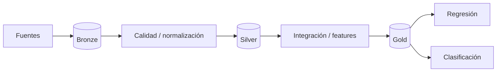

# Wayra AI — Documentación general del sistema

## Resumen ejecutivo

Wayra AI es una plataforma de investigación para el análisis climático y la predicción experimental de precipitaciones en el Perú. El proyecto combina ingeniería de datos geoespaciales, trazabilidad temporal y aprendizaje automático con cobertura nacional.

El núcleo académico contempla dos problemas independientes: una **regresión** para estimar precipitación futura en milímetros y una **clasificación** para determinar la superación de un umbral de lluvia extrema. Ambos deberán evaluarse con datasets reales, separación cronológica y métricas reproducibles.

La arquitectura distingue datos históricos consolidados de cualquier futura operación en tiempo real. Wayra AI no sustituye los servicios oficiales del Estado ni convierte automáticamente una predicción de lluvia en un pronóstico de desastre.

## 1. Problemática

Perú presenta una geografía y climatología heterogéneas. Costa, Andes y Amazonía responden de forma distinta a condiciones atmosféricas y oceánicas. Los datos necesarios para estudiar esa variabilidad están distribuidos en distintas instituciones, resoluciones, formatos y escalas temporales.

Wayra AI aborda el problema desde la integración: construir una base climática nacional reproducible antes de entrenar modelos y publicar resultados.

## 2. Objetivo general

Diseñar e implementar una plataforma nacional de análisis climático capaz de integrar datos meteorológicos y oceanográficos, construir datasets trazables y desarrollar modelos supervisados para precipitación futura y lluvia extrema.

## 3. Objetivos específicos

1. Integrar fuentes climáticas abiertas y verificables.
2. Normalizar ubicación, fechas, unidades y metadatos.
3. Construir una cuadrícula común para todo Perú.
4. Mantener un Data Lake Bronze/Silver/Gold.
5. Desarrollar un pipeline de regresión.
6. Desarrollar un pipeline de clasificación.
7. Evaluar modelos sin fuga temporal.
8. Documentar modelos, resultados y limitaciones.
9. Preparar una arquitectura extensible para servicios web y peligros naturales futuros.

## 4. Cobertura

La cobertura definida es **Perú completo**. La malla de trabajo propuesta es de 0.1° en EPSG:4326 y se limita territorialmente mediante una máscara nacional.

La resolución de trabajo no significa precisión física exacta. Los productos originales conservan sus metadatos y resolución nativa.

## 5. Fuentes

### 5.1 CHIRPS

Fuente raster principal de precipitación histórica. El repositorio ya cuenta con un adaptador inicial de descarga diaria para CHIRPS v3 final RNL, trazabilidad y SHA-256.

### 5.2 ERA5-Land

Fuente candidata de variables atmosféricas complementarias: temperatura, punto de rocío, presión, viento y otros campos de reanálisis.

### 5.3 SENAMHI

Fuente nacional de observaciones de estaciones. El dataset público de estaciones automáticas contiene información horaria de temperatura, humedad y precipitación, además de georreferenciación y división administrativa según su ficha de datos abiertos. Debe auditarse antes de integrarlo.

### 5.4 NOAA

Subsistema oceanográfico internacional para índices relacionados con ENOS, como Niño 1+2 y Niño 3.4. Las series se almacenarán con versión y periodo de referencia.

### 5.5 IMARPE

Subsistema oceanográfico peruano. Permitirá incorporar temperatura superficial del mar y anomalías costeras sin confundir estas observaciones con los índices agregados de NOAA.

### 5.6 Extensiones

INDECI, CENEPRED e INAIGEM son fuentes relevantes para un futuro dominio de peligros naturales, pero no se utilizarán para afirmar que los modelos actuales predicen desastres.

## 6. Arquitectura de datos

### Bronze

Conserva archivos originales, URL, checksum, versión y fecha de recuperación.

### Silver

Contiene datos normalizados: unidades, timestamps, geometrías, códigos de calidad y formatos homogéneos.

### Gold

Contiene productos analíticos versionados: dataset maestro, datasets de regresión/clasificación y agregados territoriales.

## 7. Integración espacial

CHIRPS 0.05° se agrega a la malla 0.1° mediante bloques 2x2 cuando la alineación y resolución son compatibles. La implementación valida esta relación y maneja nodata explícitamente.

Las estaciones SENAMHI e IMARPE se mantienen como observaciones puntuales y se relacionan espacialmente con la cuadrícula sin afirmar que una estación representa por sí sola toda una celda.

## 8. Integración temporal

Wayra AI diferencia:

- fecha/intervalo observado;
- fecha de publicación cuando pueda verificarse;
- última modificación técnica del archivo;
- fecha de descarga;
- primera disponibilidad demostrable;
- instante de emisión de la predicción.

Esta separación previene que un modelo use información que no habría existido todavía en el momento de la predicción.

## 9. Regresión

El target propuesto es precipitación del siguiente día expresada en milímetros.

El pipeline deberá incluir EDA, features temporales válidas, split cronológico, baseline, LazyRegressor, comparación por RMSE/R², selección del modelo, evaluación final y predicción de un nuevo registro.

## 10. Clasificación

El target propuesto es la superación de un umbral de lluvia extrema en el siguiente día.

El umbral se calculará sin utilizar el conjunto test. El pipeline deberá incluir balance de clases, LazyClassifier, dos modelos seleccionados, matrices de confusión y predicción con probabilidad cuando sea posible.

## 11. Modo retrospectivo y modo operativo

El modo retrospectivo utiliza datos históricos consolidados y es el objetivo académico inmediato.

El modo operativo permanece deshabilitado. Solo podrá habilitarse con datos disponibles antes del instante de emisión, fuentes oportunas, replay temporal, monitoreo y validación adicional.

## 12. Peligros naturales

El dominio de peligros será modular. Inundación, huaico, deslizamiento o peligro glaciar requieren modelos, etiquetas y variables propias. Un valor alto de precipitación no constituye por sí solo una predicción de desastre.

## 13. Estado de implementación

Implementado o presente en la rama de mejora:

- configuración Python 3.12;
- adaptador CHIRPS;
- SHA-256 y manifiestos;
- malla 0.1°;
- máscara territorial PER-ADM0;
- remuestreo con validaciones;
- smoke de preprocesamiento;
- pruebas unitarias para ingesta y malla;
- workflow de GitHub Actions;
- documentación Mermaid;
- fuentes JSON para Archify.

Pendiente:

- integración ERA5-Land/SENAMHI/NOAA/IMARPE;
- Data Lake Silver/Gold completo;
- dataset maestro multi-fuente;
- EDA definitivo;
- LazyRegressor/LazyClassifier;
- métricas finales;
- modelos persistidos;
- API y frontend.

## 14. Calidad

El proyecto adopta como reglas:

- no inventar datos ni métricas;
- versionar datasets y experimentos;
- mantener checksums;
- usar splits temporales;
- probar contratos críticos;
- mantener README sincronizado con código;
- separar arquitectura actual de arquitectura propuesta.

## 15. OpenCode, Obsidian, Graphify y Archify

`AGENTS.md` define el flujo de trabajo para agentes. Obsidian mantiene memoria documental selectiva. Graphify puede utilizarse para comprender relaciones del código cuando el proyecto tenga suficiente volumen. Archify documenta la arquitectura interactiva y Mermaid permite visualizar flujos directamente desde GitHub.

## 16. Riesgos técnicos

- disponibilidad desigual de estaciones;
- diferencias entre productos raster y mediciones puntuales;
- latencias de publicación;
- dependencia entre algunas fuentes;
- eventos extremos desbalanceados;
- costo de procesar décadas de datos nacionales;
- fuga temporal en features;
- cambios de versión de fuentes externas.

## 17. Hoja de ruta

1. estabilizar ingesta y pruebas;
2. auditar fuentes adicionales;
3. construir Bronze/Silver/Gold;
4. generar dataset maestro;
5. completar EDA;
6. implementar regresión;
7. implementar clasificación;
8. elaborar evaluación académica;
9. construir API retrospectiva;
10. desarrollar frontend;
11. investigar modo operativo y peligros especializados.

## 18. Conclusión

Wayra AI se plantea como una plataforma de inteligencia climática basada en trazabilidad y reproducibilidad. El valor del sistema no reside únicamente en ejecutar modelos, sino en demostrar de dónde proviene cada dato, cuándo estaba disponible, cómo fue transformado y qué tan bien generaliza el modelo sobre información posterior.

El siguiente hito científico es obtener una serie temporal nacional suficiente y construir un dataset Gold reproducible para completar los dos pipelines exigidos por la evaluación académica.
