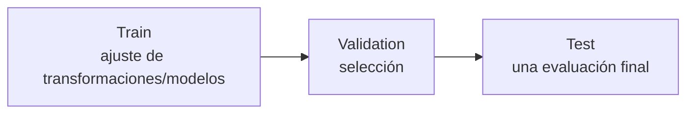

# Wayra AI — Mapeo con la rúbrica del Avance 2

Este documento convierte la rúbrica académica en artefactos técnicos verificables. Un criterio solo se marca como completado cuando existe evidencia reproducible.

## 1. Regresión

| Criterio | Evidencia esperada en Wayra AI | Estado actual |
|---|---|---|
| EDA | dimensiones, tipos, target, nulos, duplicados, inconsistencias/outliers, estadísticas y gráficos | pendiente de dataset Gold suficiente |
| Preparación | definición X/y, transformaciones y separación temporal | diseño definido; implementación final pendiente |
| LazyRegressor | tabla comparable de modelos, RMSE y R² | pendiente |
| Modelo ganador | entrenamiento explícito y justificación | pendiente |
| Visualización | comparación RMSE/R² y gráficos de predicción/error | pendiente |
| Nuevo registro | inferencia con registro representativo e interpretación | pendiente |

### Target propuesto

`precipitation_next_day_mm`

La observación en `t+1` nunca puede aparecer directa o indirectamente dentro de las features de `t`.

### Métricas mínimas

- RMSE;
- R²;
- MAE complementaria;
- baseline explícito.

## 2. Clasificación

| Criterio | Evidencia esperada | Estado actual |
|---|---|---|
| EDA | incluye distribución/balance de clase | pendiente |
| Preparación | X/y, encoding si aplica, split temporal | diseño definido |
| LazyClassifier | tabla por Accuracy/Balanced Accuracy | pendiente |
| Dos mejores modelos | entrenamiento explícito con la misma evaluación | pendiente |
| Matrices de confusión | dos matrices + interpretación TP/TN/FP/FN | pendiente |
| Nuevo registro | clase y probabilidad si el modelo lo soporta | pendiente |

### Target propuesto

`extreme_rain_next_day`

Clase 1: la precipitación futura supera un umbral extremo calculado sin utilizar el conjunto de prueba.

El umbral debe quedar versionado y documentar:

- población de referencia;
- periodo;
- tratamiento de días secos;
- alcance geográfico;
- percentil/regla elegida.

## 3. Estrategia de evaluación

La división debe ser cronológica. La propuesta inicial 2001–2022 / 2023–2024 / 2025 se mantiene como hipótesis hasta verificar el periodo común de todas las fuentes seleccionadas.



No se debe reutilizar test para elegir repetidamente algoritmos o hiperparámetros.

## 4. Evidencias que no son suficientes

- un smoke test con tres días;
- un split sin conjunto test;
- un README con métricas escritas manualmente;
- una captura sin código/reproducción;
- entrenamiento sobre datos generados solo para completar la rúbrica;
- clasificación de desastre derivada únicamente de lluvia extrema.

## 5. Carpeta académica objetivo

```text
docs/academic/
├── avance-2-mapping.md
├── eda-regression.md
├── regression-results.md
├── eda-classification.md
├── classification-results.md
├── experiment-manifest.json
└── defense-guide.md
```

Los documentos de resultados se crearán a partir de ejecuciones reales, no antes.

## 6. Checklist de entrega

### Regresión

- [ ] dataset y target identificados;
- [ ] EDA completo;
- [ ] X/y y transformaciones documentadas;
- [ ] split temporal reproducible;
- [ ] LazyRegressor ejecutado;
- [ ] RMSE/R² presentados;
- [ ] ganador entrenado;
- [ ] predicción de nuevo registro.

### Clasificación

- [ ] etiqueta y umbral documentados;
- [ ] balance de clases analizado;
- [ ] LazyClassifier ejecutado;
- [ ] dos modelos entrenados;
- [ ] dos matrices de confusión;
- [ ] TP/TN/FP/FN interpretados;
- [ ] predicción y probabilidad si aplica.

## 7. Defensa individual

La sustentación debe poder explicar:

1. por qué se seleccionaron los datasets;
2. cómo se evitó fuga temporal;
3. qué significa la cuadrícula 0.1°;
4. diferencias entre estación, satélite/reanálisis y producto raster;
5. por qué RMSE/R² son relevantes;
6. por qué Balanced Accuracy/Recall importan con eventos raros;
7. qué representa la matriz de confusión;
8. por qué Wayra AI no afirma predecir inundaciones con el clasificador de lluvia;
9. limitaciones y futuras mejoras.
