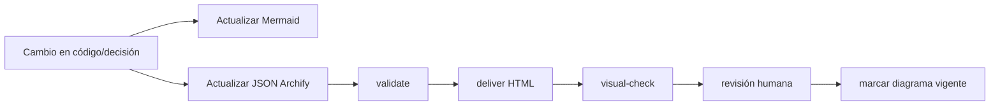

# Índice de arquitectura — Wayra AI

La documentación separa **arquitectura actual comprobable** de **arquitectura objetivo**. Fuente viva de decisiones: [[../knowledge/08-decisions]].

| Artefacto | Pregunta que responde | Estado |
|---|---|---|
| [`wayra-ai-specification.md`](wayra-ai-specification.md) | ¿Cuáles son los contratos y decisiones de arquitectura? | vigente |
| [`archify.md`](archify.md) | ¿Cómo mantener/renderizar los diagramas interactivos? | vigente |
| `diagrams/wayra-current.architecture.json` | ¿Qué componentes existen realmente? | fuente Archify preparada; validación local pendiente |
| `diagrams/wayra-propuesta.architecture.json` | ¿Cuál es la arquitectura objetivo? | propuesta; requiere actualización/validación al cambiar el plan |
| Mermaid del README | ¿Cómo fluyen datos, tiempo y modelos? | vigente con el estado actual |
| Capturas `*.visual-check.*.png` | Evidencia visual de renders Archify previos | históricas; no implican que el JSON nuevo haya sido validado |

## Reglas

1. **Arquitectura actual** contiene solo componentes con evidencia en el repositorio.
2. **Arquitectura propuesta** puede incluir futuros módulos, siempre etiquetados como tales.
3. Mermaid se usa para documentación Markdown visible directamente en GitHub.
4. Archify se usa para una vista interactiva y debe pasar `validate`, `deliver`, `visual-check` y revisión humana antes de declararse validado.
5. API, frontend y modelos de ML no se presentan como implementados mientras sus directorios/artefactos permanezcan ausentes.
6. No crear diagramas decorativos: cada vista responde una pregunta concreta.

## Flujo documental

