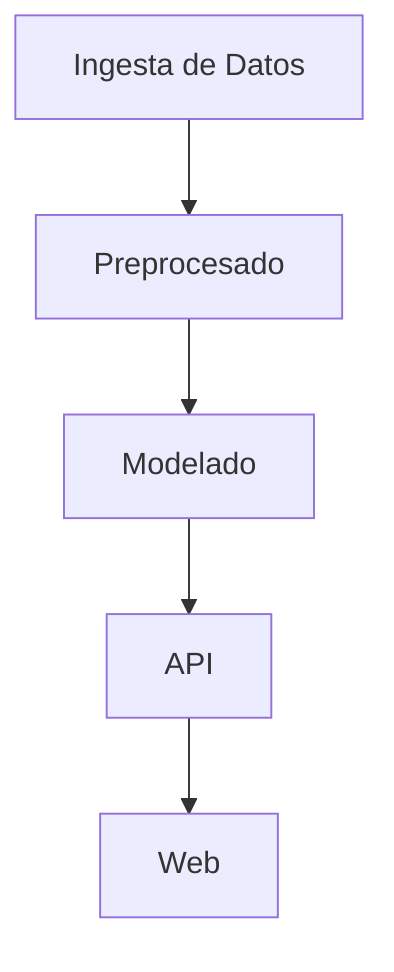
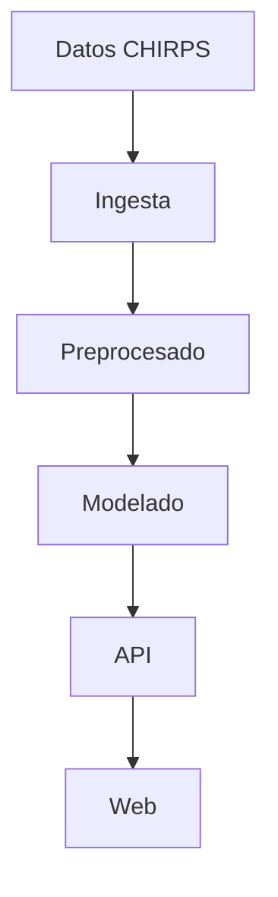
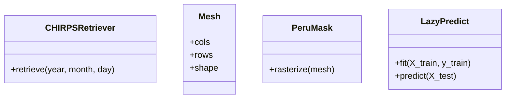

# Arquitectura de Wayra AI

## Descripción

Wayra AI es un sistema open source para el análisis climático y predicción de precipitaciones en el Perú. Utiliza datos auténticos de CHIRPS, implementa modelos de aprendizaje automático con LazyPredict, y proporciona una API FastAPI para consultas. La plataforma incluye una interfaz web en español y está documentada con Mermaid y Archify.

## Componentes Principales

- **Ingesta de Datos**: Módulo para descargar y procesar datos de CHIRPS.
- **Preprocesado**: Módulo para re-muestreo y máscara de datos.
- **Modelado**: Implementación de modelos de predicción.
- **API**: Interfaz FastAPI para consultas.
- **Web**: Interfaz web en español.

## Diagrama de Arquitectura

## Diagrama de Flujo de Datos

## Diagrama de Clases

