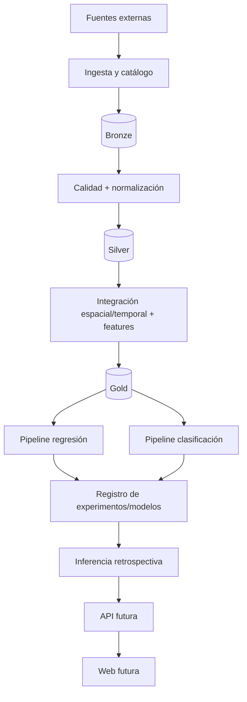
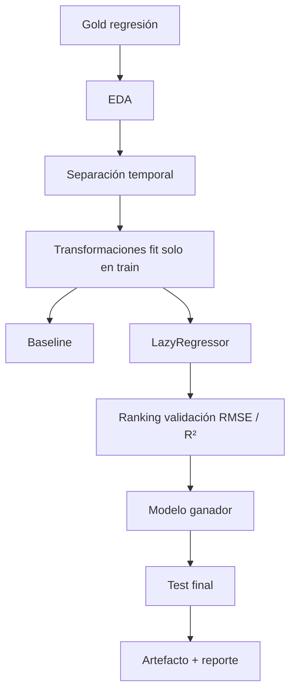
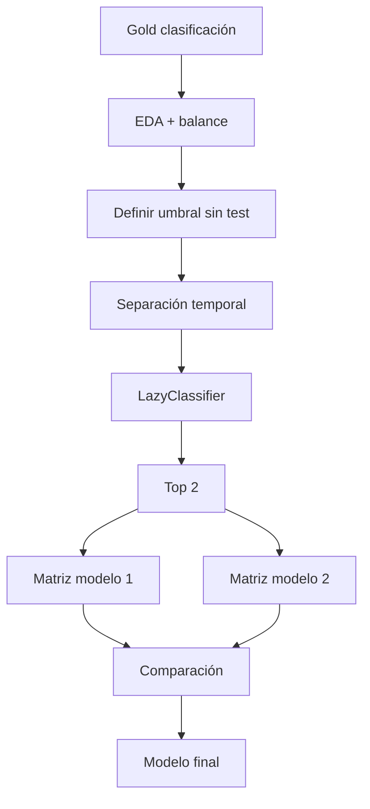

# Wayra AI — Especificación técnica de arquitectura

**Versión:** 1.1  
**Estado:** propuesta de arquitectura con núcleo parcial implementado  
**Cobertura:** Perú completo  
**Fecha:** 2026-09-22

## 1. Propósito

Wayra AI es una plataforma de investigación climática orientada a construir datasets nacionales reproducibles y dos pipelines de aprendizaje supervisado: regresión de precipitación futura y clasificación de lluvia extrema.

La arquitectura prioriza cuatro propiedades: **trazabilidad, reproducibilidad, separación de responsabilidades y honestidad operativa**. Un módulo solo puede describirse como implementado cuando existe código verificable; una capacidad predictiva solo puede declararse validada cuando dispone de datos, split y métricas reproducibles.

## 2. Decisiones vigentes

| ID | Decisión | Estado |
|---|---|---|
| ADR-001 | Cobertura nacional mediante cuadrícula territorial común | aprobada |
| ADR-002 | CHIRPS, ERA5-Land y SENAMHI como fuentes climáticas principales | aprobada conceptualmente |
| ADR-003 | NOAA e IMARPE como subsistemas oceanográficos independientes | aprobada conceptualmente |
| ADR-004 | Data Lake Bronze/Silver/Gold + metadatos persistentes | propuesta objetivo |
| ADR-005 | Pipelines independientes de regresión y clasificación | requisito académico |
| ADR-006 | Separar análisis histórico de pronóstico operativo | aprobada |
| ADR-007 | Peligros naturales como dominio extensible separado | aprobada |
| ADR-008 | Python 3.12 + uv para núcleo científico | aprobada |
| ADR-009 | Mermaid en Markdown y Archify para arquitectura interactiva | aprobada para documentación |

## 3. Vista por capas



### Estado del código actual

El código funcional cubre la ingesta inicial de CHIRPS y parte del preprocesamiento geoespacial. Bronze/Silver/Gold, integración multi-fuente, ML, API y web son arquitectura objetivo y deben implementarse incrementalmente.

## 4. Subsistema de fuentes

Cada proveedor se encapsula detrás de un adaptador. Los adaptadores no necesitan compartir protocolo de red, pero sí un contrato de salida común.

### 4.1 Contrato mínimo de adquisición

```text
source_id
product_id
source_version
source_url
retrieved_at
published_at?          # solo si es verificable
source_last_modified?  # metadato HTTP, no sinónimo de published_at
sha256
checksum_verified
checksum_source
storage_path
license
status
```

Estados de adquisición sugeridos:

- `discovered`
- `downloaded`
- `verified_local`
- `verified_external`
- `schema_validated`
- `rejected`

### 4.2 Adaptadores objetivo

- `CHIRPSAdapter`: precipitación diaria raster.
- `ERA5LandAdapter`: reanálisis meteorológico.
- `SenamhiAdapter`: observaciones puntuales de estaciones.
- `NoaaEnsoAdapter`: índices oceánicos.
- `ImarpeOceanAdapter`: TSM/anomalías costeras.

Ningún adaptador debe convertir silenciosamente un error de red, credenciales o esquema en datos sintéticos.

## 5. Data Lake

### 5.1 Bronze

Responsabilidad: preservar el dato obtenido del proveedor.

Reglas:

1. archivo original inmutable;
2. checksum y URL de procedencia;
3. fecha de recuperación;
4. versión del producto si existe;
5. licencia o condiciones de acceso;
6. manifiesto por lote/ejecución.

Particionamiento sugerido:

```text
data/raw/<source>/<product>/<year>/<month>/...
```

### 5.2 Silver

Responsabilidad: representar observaciones normalizadas sin perder linaje.

Operaciones permitidas:

- conversión de unidades;
- normalización de timestamps;
- codificación uniforme de valores faltantes;
- validación de coordenadas;
- control de rango;
- alineación geográfica;
- agregación temporal documentada;
- banderas de calidad.

Cada registro Silver debe poder rastrearse a uno o más assets Bronze.

### 5.3 Gold

Responsabilidad: construir productos analíticos estables.

Productos previstos:

- `climate_master_daily_v*`
- `regression_next_day_v*`
- `classification_extreme_rain_v*`
- agregados territoriales para consulta.

Los datasets usados para entrenamiento deben ser versionados e inmutables. Cambiar una transformación relevante produce una nueva versión.

## 6. Metadatos persistentes

PostgreSQL/PostGIS es candidato para el catálogo y relaciones espaciales. Los rasteres masivos pueden permanecer en formatos de archivo especializados.

Entidades conceptuales:

| Entidad | Responsabilidad |
|---|---|
| `data_sources` | proveedor e institución |
| `data_products` | producto y frecuencia |
| `dataset_versions` | versión lógica y periodo |
| `data_assets` | archivos físicos, hash y ruta |
| `ingestion_runs` | ejecución de adquisición |
| `quality_reports` | resultados QC |
| `grid_cells` | malla nacional |
| `stations` | estaciones/laboratorios |
| `experiments` | configuración científica |
| `model_versions` | modelo persistido y métricas |
| `predictions` | inferencias y trazabilidad |

La base relacional no es obligatoria para el primer smoke local, pero el contrato debe mantenerse desde los manifiestos para permitir migración posterior.

## 7. Modelo geográfico

### 7.1 Cuadrícula común

- CRS: `EPSG:4326`.
- Resolución de trabajo: `0.1° x 0.1°`.
- Cobertura: bbox nacional + máscara territorial.
- Identificador estable: `cell_id`.

La máscara define qué celdas intersectan Perú. Para agregaciones administrativas posteriores se recomienda una tabla de intersección `cell_id ↔ ubigeo` con pesos de área cuando corresponda.

### 7.2 Regla de remuestreo

Para CHIRPS 0.05° → Wayra 0.1° se utiliza agregación 2x2 con media y tratamiento explícito de nodata. La implementación debe rechazar relaciones de resolución incompatibles.

Nunca se presentará la malla 0.1° como precisión física exacta de 10 km.

## 8. Modelo temporal

### 8.1 Campos

| Campo | Definición |
|---|---|
| `valid_from` | inicio del periodo representado |
| `valid_to` | final del periodo representado |
| `observation_time` | instante/fecha observada cuando sea puntual |
| `published_at` | instante de publicación verificable |
| `source_last_modified` | metadato técnico del asset |
| `retrieved_at` | descarga por Wayra AI |
| `available_at` | primera disponibilidad demostrable para modelado |
| `processed_at` | transformación interna |
| `forecast_issued_at` | emisión de una predicción |

### 8.2 Restricción anti-fuga

Para una feature observacional usada en una predicción:

```text
available_at <= forecast_issued_at
```

Cuando `available_at` no pueda reconstruirse históricamente, el experimento se etiqueta como retrospectivo y no como replay operativo estricto.

`published_at` nunca debe inferirse simplemente desde la fecha de observación.

## 9. Dataset maestro diario

Granularidad propuesta:

```text
(cell_id, reference_date, dataset_version)
```

Grupos de columnas:

### Identidad

- `cell_id`
- `reference_date`
- `latitude`
- `longitude`
- claves territoriales derivadas cuando correspondan

### Meteorología

- precipitación
- temperatura
- punto de rocío/humedad cuando sea válido
- presión
- componentes/velocidad de viento

### Oceanografía

- Niño 1+2
- Niño 3.4
- RONI u otro índice versionado
- variables IMARPE cuando exista correspondencia temporal válida

### Calidad y linaje

- fuente/producto/versión
- banderas de completitud
- identificadores de assets Bronze
- timestamps de disponibilidad

### Features derivadas

- lags exclusivamente anteriores al objetivo;
- acumulados rodantes cerrados en `t`;
- variables calendarias;
- climatologías/anomalías construidas sin usar test futuro.

## 10. Pipeline de regresión

Objetivo propuesto: precipitación del siguiente día en milímetros.



Obligatorios:

- RMSE;
- R²;
- gráfico comparativo;
- selección justificada;
- predicción de nuevo registro representativo.

MAE puede añadirse como métrica complementaria.

## 11. Pipeline de clasificación

Objetivo propuesto: clase binaria de superación de un umbral de lluvia extrema.

El umbral debe definirse con entrenamiento o una climatología fijada previamente; nunca se calcula utilizando el test final.



Métricas:

- Accuracy/Balanced Accuracy según rúbrica;
- Precision;
- Recall;
- F1;
- matrices de confusión;
- probabilidad de clase cuando el estimador lo soporte.

La etiqueta representa lluvia extrema, no desastre.

## 12. Separación retrospectiva/operativa

### Retrospectivo

Usa productos históricos consolidados. Es el modo prioritario para el Avance 2.

### Operativo

Solo se habilitará cuando:

1. las entradas se obtengan antes del instante de emisión;
2. la latencia de cada producto esté documentada;
3. el modelo haya sido validado mediante replay temporal realista;
4. existan controles de versión, fallback y monitoreo;
5. la interfaz diferencie claramente pronóstico experimental de información oficial.

Hasta entonces, `operational_mode = disabled`.

## 13. Dominio de peligros naturales

Los peligros futuros se modelan como productos separados:

- inundación;
- crecida de río;
- huaico/deslizamiento;
- peligro glaciar.

Cada producto necesita dataset objetivo, variables específicas y evaluación independiente. El módulo inicial solo puede incorporar mapas o eventos oficiales con su fuente y fecha, sin convertir lluvia extrema en un pronóstico de desastre.

## 14. Servicios de aplicación futuros

Cuando el núcleo científico sea estable, la API podrá exponer rutas versionadas como:

```text
GET  /api/v1/health
GET  /api/v1/sources
GET  /api/v1/datasets
GET  /api/v1/climate/history
GET  /api/v1/enso/indices
GET  /api/v1/models
POST /api/v1/predict/regression
POST /api/v1/predict/classification
```

El entrenamiento pesado no se ejecutará dentro de una petición HTTP. La API solo debe consumir artefactos versionados y validados para el modo que corresponda.

## 15. Observabilidad

Registrar por proceso:

- `run_id`;
- inicio/fin;
- fuente y versión;
- archivos procesados;
- cantidad de filas/celdas;
- rechazos y advertencias;
- duración;
- versión de código/commit;
- artefactos producidos.

Los logs no deben contener secretos.

## 16. Seguridad

- credenciales únicamente fuera de Git;
- `.env` o mecanismo seguro equivalente;
- tokens no impresos en consola/documentación;
- validar entradas de API antes de exposición pública;
- dependencias fijadas y revisadas;
- datasets sensibles o con redistribución restringida nunca se versionan sin autorización.

## 17. Quality gates

Un componente no pasa a “validado” solo porque exista.

### Data gate

- fuente y versión registradas;
- schema conocido;
- checksum local;
- cobertura temporal/espacial auditada;
- valores faltantes cuantificados;
- transformaciones reproducibles.

### ML gate

- dataset Gold versionado;
- train/validation/test independientes;
- baseline;
- pipeline sin fuga;
- resultados reproducibles;
- artefacto persistido;
- interpretación y limitaciones.

### Documentation gate

- README coincide con código;
- Mermaid actualizado;
- fuente Archify actualizada;
- no hay afirmaciones de funcionalidades ausentes;
- comandos de instalación comprobables.

## 18. Estrategia de evolución

1. consolidar ingesta/preprocesamiento CHIRPS con tests;
2. formalizar catálogo Bronze/Silver/Gold;
3. implementar fuentes complementarias;
4. construir dataset maestro nacional;
5. completar EDA;
6. entrenar regresión;
7. entrenar clasificación;
8. producir evaluación académica;
9. exponer inferencia retrospectiva;
10. implementar API y web;
11. investigar modo operativo.

Esta secuencia evita construir una interfaz que simule capacidades científicas que todavía no existen.
